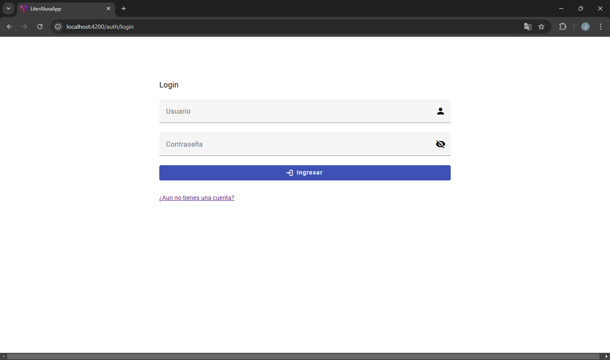
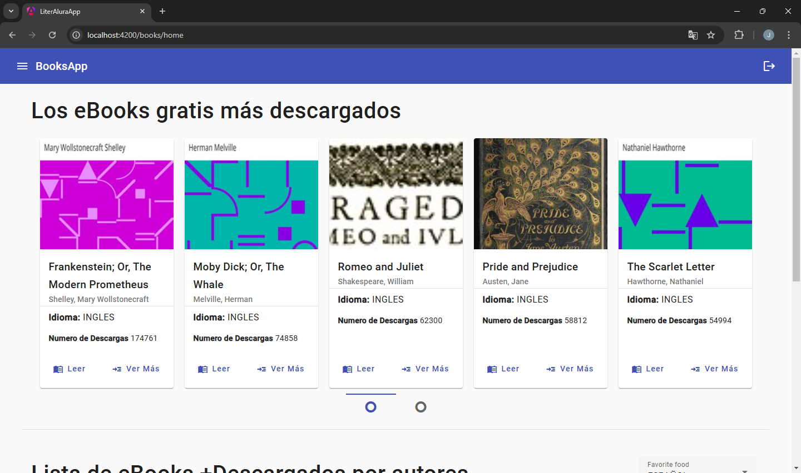
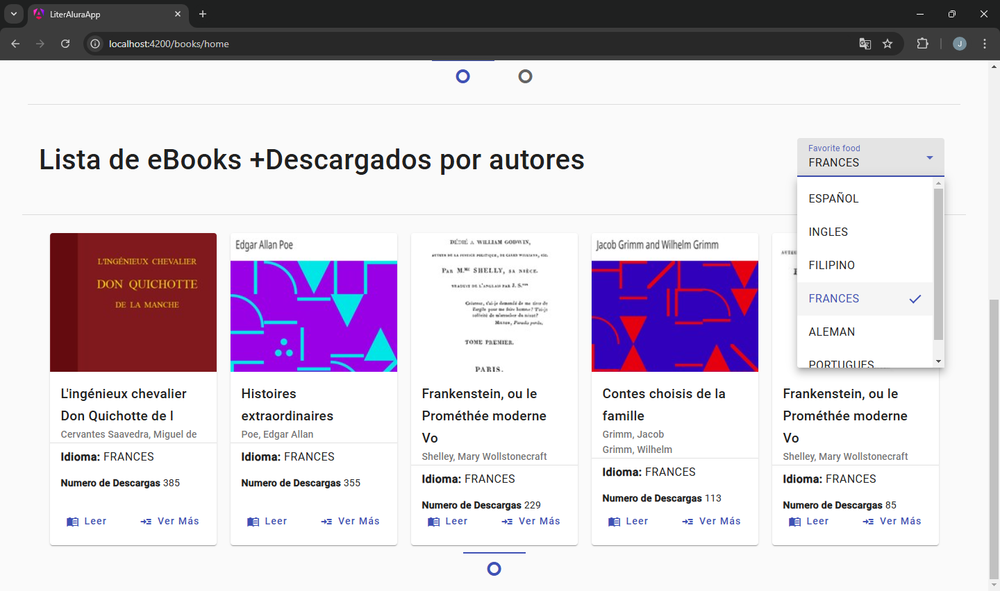
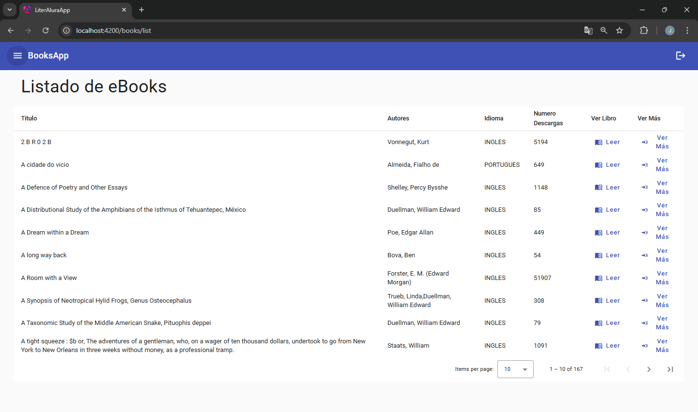
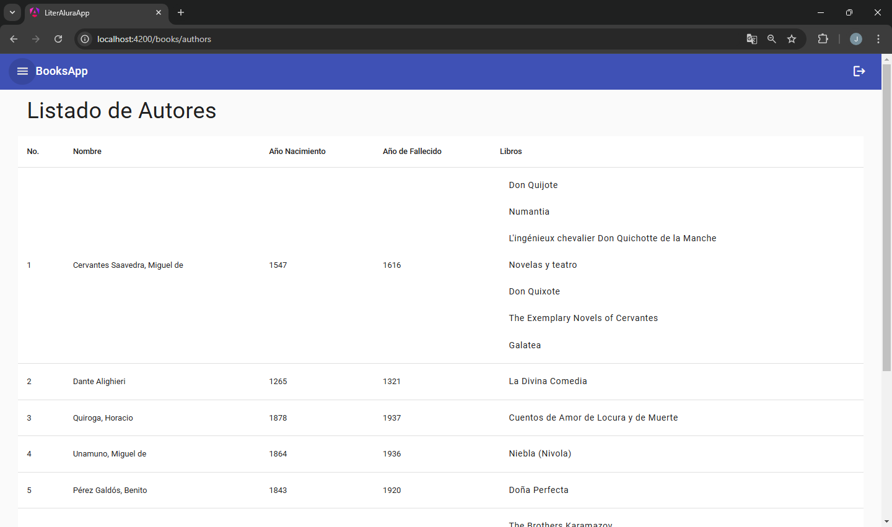
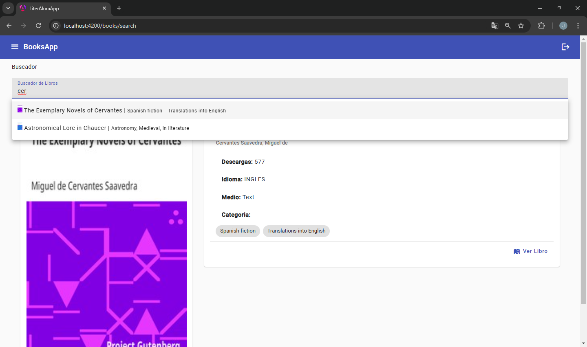

# Catálogo de Libros 👀📖📚

Este repositorio contiene el código fuente de 2 aplicaciones: 
- Aplicacion por consola llamado "Catálogo de Libros - Interacción Textual". La cual cuenta con una interfaz por consola que consume una API para guardar los registros de libros en su base de datos y para su posterior uso.
- Aplicación Web llamada "Catálogo de Libros - Interfaz Web Interactiva (Backend - Frontend)". La aplicación cuenta con una interfaz de usuario desarrollada con Angular y una API REST construida con Spring Boot. Los datos se almacenan en una base de datos PostgreSQL.


    ## 1. Catálogo de Libros - Interacción Textual 👀📖📚

    Este proyecto es un catálogo de libros que permite la interacción con el usuario a través de una interfaz de línea de comandos. Los usuarios pueden buscar libros, listar autores, y consultar diversas estadísticas relacionadas con los libros almacenados en una base de datos PostgreSQL

    ### Cómo Empezar 🚀

    Prerrequisitos:
    - Java 8 o superior.
    - Spring Boot 3
    - Conexión a Internet.
    - API de Gutendex.

    ### Instalación
    1. Clona este repositorio:

        ```ts
        git clone https://github.com/jissykakin/LiterAluraApp.git
        ```

    2. Configurar la base de datos:
    - Crear la base de datos en PostgreSQL.
        ```ts
        CREATE DATABASE "literAluraDB"
            WITH
            OWNER = postgres
            ENCODING = 'UTF8'
            LC_COLLATE = 'Spanish_Spain.1252'
            LC_CTYPE = 'Spanish_Spain.1252'
            LOCALE_PROVIDER = 'libc'
            TABLESPACE = pg_default
            CONNECTION LIMIT = -1
            IS_TEMPLATE = False; 
        ```
    - Crea las tabla Users e inserta:
        ```
            ts
            CREATE TABLE IF NOT EXISTS public.users
            (
                id bigint NOT NULL GENERATED BY DEFAULT AS IDENTITY ( INCREMENT 1 START 1 MINVALUE 1 MAXVALUE 9223372036854775807 CACHE 1 ),
                email character varying(255) COLLATE pg_catalog."default",
                username character varying(255) COLLATE pg_catalog."default",
                CONSTRAINT users_pkey PRIMARY KEY (id),
                CONSTRAINT uk6dotkott2kjsp8vw4d0m25fb7 UNIQUE (email),
                CONSTRAINT ukr43af9ap4edm43mmtq01oddj6 UNIQUE (username)
            )


            INSERT INTO public.users(
            id, email, username)
            VALUES (1, 'test@test.com', 'UserTest');
        ```
    - Configurar las credenciales de la base de datos en las variables de entornos puedes visualizarlas en el archivo  application.properties.

    3. Navega a la carpeta del proyecto:
        ```
        cd LiterALura/src/main/com.challenger.literAlura
        ```
    3. Compila el código: ``` javac LiterAluraAplication.java.```


    4. Ejecuta el programa con ```java LiterAluraAplication```.


    ### Menú Principal 🍽️

    Cuando ejecutes el programa, verás el siguiente menú:

    ```
    ***** Menú Principal *****

    1 - Buscar Libro por Titulo
    2 - Listar Libros Registrados
    3 - Listar Autores Registrados
    4 - Listar Autores Vivos en un determinado año
    5 - Listar Libros por Idioma
    6 - Listar Libros por Nombre de Autor
    7 - Listar Top 10 de los Libros más descargados
    8 - Listar Autor por Nombre
    9 - Listar Estadisticas de Libros

    0 - Salir
    
    ***********************************
    ```


    ### Funcionalidades 🛠️

    - **Opción 1 - Buscar libro por título:** Realiza búsquedas en la API Gutendex y almacena los resultados en la base de datos para futuras consultas.

    


    - **Opción 2 - Listar libros registrados:** Muestra todos los libros almacenados en la base de datos.

    

    - **Opción 3 - Listar autores registrados:** Muestra una lista de todos los autores presentes en la base de datos.

    

    - **Opción 4 - Listar autores vivos en un determinado año:** Consulta la base de datos para obtener los autores que estaban vivos en un año específico.

    

    - **Opción 5 - Listar libros por idioma:** Muestra los libros disponibles en un idioma determinado.

    

    - **Opción 6 - Listar libros por nombre de autor:** Muestra los libros escritos por un autor específico.

    

    - **Opción 7 - Listar Top 10 de los libros más descargados:** Presenta una lista de los 10 libros más populares según las descargas.

    

    - **Opción 8 - Listar autor por nombre:** Busca un autor específico por su nombre.

    

    - **Opción 9 - Listar estadísticas de libros:** Proporciona información estadística sobre los libros, como el número total de libros, autores, idiomas, etc.

    


    ### Tecnologías Utilizadas: ⚙️

    - Java: Lenguaje de programación principal.
    - Spring Boot 3: Framework Java para desarrollo de aplicaciones web.
    - PostgreSQL: Base de datos relacional para almacenar la información de los libros.
    - API Gutendex: Fuente externa de datos para obtener información sobre libros.


    ## 2. Catálogo de Libros - Interfaz Web Interactiva (Backend - Frontend) 📖📚🖥️📱

    Este proyecto es un catálogo de libros que ofrece una interfaz web interactiva construida con Angular, permitiendo a los usuarios buscar libros, listar libros y autores. La aplicación se conecta a un backend desarrollado con Spring Boot y utiliza una base de datos PostgreSQL para almacenar la información de los libros y usuarios.

    ### Instalación
    1. Realiza los punto 1 y 2 del proceso de instalación de Interracion textual
    2. Ejecura el Backend 
        - Ingresa a la ruta:
            ```
            cd backend/literALura/src/main/com.challenger.literAlura
            ```
        - Compila el código: ``` javac LiterAluraAplication.java.```
        - Ejecuta el programa con ```java LiterAluraAplication```.

    3. Ejecuta el Frontend
        - Ingresa a la ruta
            ```
            cd frontend/literALura/
            ```
        - Ejecutar ``` npm install ```
        - Ejecutar la app ``` npm start ``` o el comando ``` ng serve -o ```


    ### Funcionalidades 🛠️

    - **Inicio de sesión:** Los usuarios deben iniciar sesión para acceder a las funcionalidades del catálogo. (No necesita ingresar usuario y contraseña dejarlo en blanco)

        

    - **Panel de control:** Una vez autenticado, el usuario accede a un panel con las siguientes opciones:
        - **Top 10 de libros más descargados:** Visualiza una lista de los libros más populares.
            

        - **Top 10 de descargas por idioma:** Muestra los 10 libros más descargados por cada idioma.
            

    - **Listar todos los libros:** Presenta un listado completo de los libros disponibles.
        

    - **Listar todos los autores:** Muestra una lista de todos los autores.
        

    - **Buscar libros por nombre:** Permite realizar búsquedas de libros por título.
        
 

    ### Tecnologías Utilizadas: ⚙️

    - **Frontend (Angular):** Contiene los componentes, servicios y estilos de la aplicación web.
    - **Backend (Java - Spring Boot):** Contiene los controladores, servicios, repositorios y entidades de la API REST.
    - **Base de datos:** PostgreSQL con las tablas para almacenar la información de los libros, autores y usuarios.

